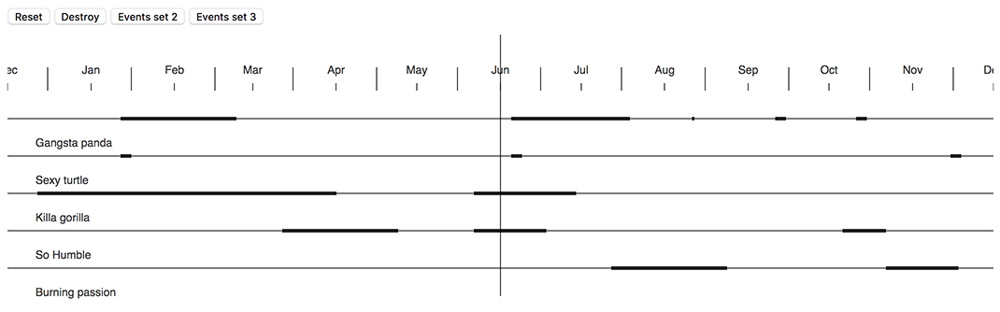

# D3 timeline scroll [](https://travis-ci.org/wearereasonablepeople/d3-timeline-scroll)

> A useful infinite scrollable timeline built with D3.

<div align="center">
  <br/>
  
</div>


## Dependencies
Library depends on [D3](https://d3js.org) in version **3**.
You can pass an instance of d3 as third argument to contructor (By default `window.d3` is used)

## Install

```bash
$ npm install d3-timeline-scroll --save
```

You can use either:

* pre-build version in `dist`
* import from the `src` folder – would require use of `sass-loader` in case you using webpack

## Build

```bash
$ npm run build
```

## Develop

```bash
$ npm start
```

## Usage

> See [examples](./examples) as well

```javascript
import d3 from 'd3';

import Timeline from 'd3-timeline-scroll';

const el = document.getElementById('#graph');

const instace = new Timeline(el, {
  events: [],
  startdate: new Date(),      // centers timeline at date [default: new Date()]
  autoresize: true,           // makes timeline responsive [default: true]
  lineheight: 60,             // height of one category
  onscroll: function(date){
    console.log(date);        // currently centered date
  }
}, d3Instance = window.d3 || d3);

//redraw timeline with new set of events;
instance.update([
  {
    label: 'Killa gorilla',
    items: [
      {
        start: new Date('2017-03-16'),
        end: new Date('2017-03-24'),
      },
      {
        start: new Date('2017-07-22'),
        end: new Date('2017-08-18'),
      }
    ]
  }
]);

//destroy instance and remove all listeners
instance.destroy();

```
